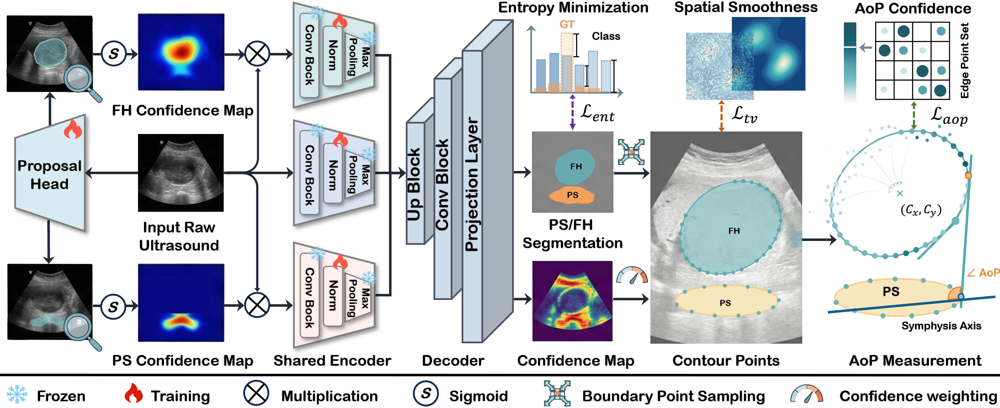
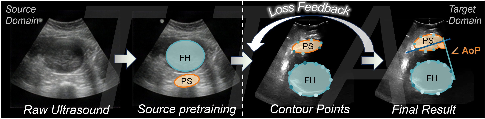
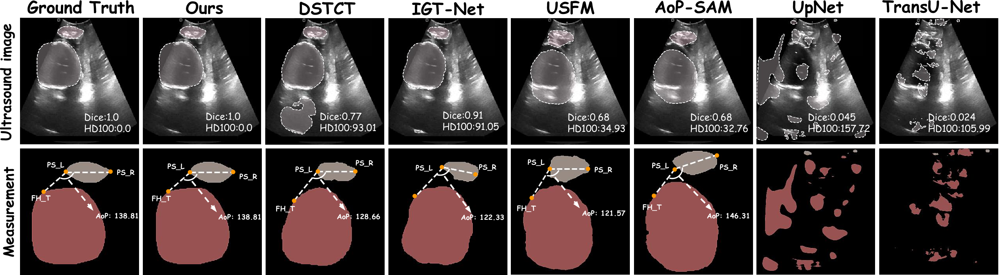
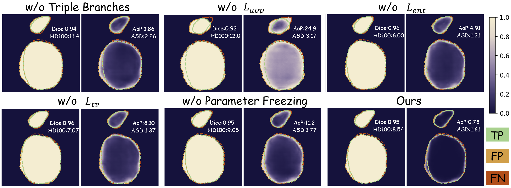

<p align="center">
  <h1 align="center">R2AoP: Reliability-aware Robust Estimation of Angle of Progression</h1>
</p>

<p align="center">
  <em>基于可靠性感知的鲁棒产程进展角估计 — MICCAI 2026</em>
</p>

<p align="center">
  
  
  
  
</p>

---

## 📌 概述

**R2AoP** 是一种面向产科超声的自动化产程进展角（Angle of Progression, AoP）估计方法。该方法通过**置信度引导的几何建模**和测试时自适应（Test-Time Adaptation, TTA）策略，解决了跨域场景下 AoP 测量不稳定和不可靠的关键问题。

### ✨ 核心特点

- 🔬 **三分支局部结构增强骨干网络**：通过 gating 机制自动关注耻骨联合（PS）和胎头（FH）的局部结构
- 📊 **置信度引导的几何建模**：预测空间置信度图，用于加权椭圆拟合，显著提升 AoP 测量精度
- 🔄 **几何可靠性约束的测试时自适应**：无需目标域标注，通过几何约束在线优化模型，增强跨域泛化性
- 🧩 **模块化开关设计**：6 个独立可控模块（M1-M6），灵活组合实验配置

---

## 🏗️ 方法框架

### 整体流程

<p align="center">
  
</p>
<p align="center"><b>图 1.</b> R2AoP 整体框架。该模型同时执行PS和FH分割、AoP测量以及几何可靠性测试时的自适应。</p>

### 测试时域适应范式

<p align="center">
  
</p>
<p align="center"><b>图 2.</b> 所提出方法的源到目标流程示意图。源域训练之后进行目标域推理，并使用几何可靠反馈进行AoP计算。</p>


### 对比实验结果可视化

<p align="center">
  
</p>
<p align="center"><b>图 3.</b> 不同方法下PS/FH分割和AoP估计的定性比较。上排显示分割结果，下排显示AoP几何可视化，包括PS轴和FH切线。</p>


### 消融实验结果可视化

<p align="center">
  
</p>
<p align="center"><b>图 4.</b> 所提方法中不同组件的定性消融结果。左侧面板显示了带有真阳性（TP）、假阳性（FP）和假阴性（FN）的分割错误图，右侧面板显示了带有AoP误差和边界指标的置信度图。</p>


---

## 📁 项目结构

```
R2AoP/
├── 📄 README.md                    # 本文档
├── 🖼️ Fig.png / Fig1.png           # 论文配图
├── 📄 environment.yml              # Conda 环境配置
│
├── 📄 train.py                     # 🏋️ 训练脚本
├── 📄 pred.py                      # 🔮 预测/推理脚本（含 TTA）
├── 📄 evaluation.py                # 📊 评估脚本
│
├── 📂 models/
│   ├── 📄 model_dict.py            # 模型工厂
│   └── 📂 nnunet_2d/
│       └── 📄 nnunet_2d.py         # nnUNet2D 核心模型（M1 & M2）
│
├── 📂 utils/
│   ├── 📄 config.py                # 实验配置
│   ├── 📄 data_us.py               # 数据加载与增强
│   └── 📄 aop_confidence.py        # AoP 置信度几何计算
│
├── 📂 checkpoints/                 # 模型权重
└── 📂 out_png/                     # 预测输出
    ├── 📂 gt/                      # Ground Truth
    └── 📂 pred/                    # 预测结果
```

---

## 🔧 环境安装

### 前置要求

- Python 3.9+
- CUDA 12.x
- Conda

### 安装步骤

```bash
# 1. 克隆仓库
git clone https://github.com/your-username/R2AoP.git
cd R2AoP

# 2. 创建 Conda 环境
conda env create -f environment.yml

# 3. 激活环境
conda activate aop

# 4. 验证安装
python -c "import torch; print(f'PyTorch {torch.__version__}, CUDA: {torch.cuda.is_available()}')"
```

### 关键依赖

| 库 | 版本 | 用途 |
|---|------|------|
| PyTorch | 2.8.0 | 深度学习框架 |
| SimpleITK | 2.5.3 | 医学图像 I/O 与评估 |
| OpenCV | 4.12.0 | 椭圆拟合与图像处理 |
| einops | 0.8.1 | 张量重排 |
| fvcore | 0.1.5 | FLOPs/参数量统计 |
| batchgenerators | 0.25.1 | 医学图像增强 |

---

## 📦 数据集

### 支持的数据集

| 数据集 | 角色 | 规模 | 格式 |
|--------|------|------|------|
| [PSFHS](https://www.nature.com/articles/s41597-024-03266-4) | 源域（训练） | 1,358 张 | PNG | 
| [JNU-IFM](https://figshare.com/articles/dataset/JNU-IFM/14371652) | 目标域 1 | 78 视频序列 | MHA |
| [IUGC 2024](https://codalab.lisn.upsaclay.fr/competitions/18413) | 目标域 2 | 多中心 | MHA |

### 数据目录结构

```
# 训练数据 (PNG 格式)
PSFHS/
├── train/
│   ├── images/      # 超声图像 (.png)
│   └── labels/      # 分割标签 (.png)
└── val/
    ├── images/
    └── labels/

# 测试数据 (MHA 格式)
test_data/
├── image_mha/       # 超声图像 (.mha)
└── label_mha/       # 分割标签 (.mha)
```

### 标签编码

| 值 | 类别 |
|----|------|
| 0 | 背景 (Background) |
| 1 | 耻骨联合 (Pubic Symphysis, PS) |
| 2 | 胎头 (Fetal Head, FH) |

---

## 🚀 快速开始

### 训练

```bash
python train.py \
  --modelname nnUNet2D \
  --task PSFH \
  --batch_size 8 \
  --base_lr 1e-4 \
  --encoder_input_size 256 
```

<details>
<summary>📋 训练参数说明</summary>

| 参数 | 默认值 | 说明 |
|------|--------|------|
| `--modelname` | `nnUNet2D` | 模型名称 |
| `--task` | `PSFH` | 任务/数据集名称 |
| `--batch_size` | 8 | 批大小 |
| `--base_lr` | 1e-4 | 初始学习率 |
| `--encoder_input_size` | 256 | 输入图像尺寸 |
| `--enable_tri_encoder` | off | 启用三分支编码器 (M1) |
| `--enable_weighted_ellipse` | off | 启用置信度头 (M2) |

</details>

**输出**: 最优模型保存为 `./checkpoints/best_model.pth`

### 预测/推理

```bash
python pred.py \
  --modelname nnUNet2D \
  --ckpt ./checkpoints/your_best_model.pth \
  --data_root /path/to/test_data \
  --out_root ./out_png \
```


### 评估

```bash
# 修改 evaluation.py 中的 pred_dir 和 gt_dir 路径后运行
python evaluation.py
```

**输出示例**:

```
最终统计结果：
aop: mean=4.2219, std=3.4040
aop_gt: mean=98.2308, std=14.9232
aop_truth: mean=97.8172, std=13.7845
asd_up: mean=1.2652, std=0.6635
dice_up: mean=0.9302, std=0.0319
hd_up: mean=4.9293, std=3.0923
asd_low: mean=2.6999, std=1.4722
dice_low: mean=0.9553, std=0.0212
hd_low: mean=12.9510, std=10.0424
asd_all: mean=2.3226, std=1.1131
dice_all: mean=0.9525, std=0.0193
hd_all: mean=12.8112, std=9.1613
```

---

## 🧩 模块化开关体系 (M1 — M6)

本项目采用模块化开关设计，6 个模块可通过命令行参数灵活组合：

```
┌──────────────────────── Training ────────────────────────┐
│  M1: 三分支局部结构增强编码器  --enable_tri_encoder      │
│  M2: 置信度头 + 加权椭圆拟合  --enable_weighted_ellipse  │
└──────────────────────────────────────────────────────────┘
                             ↓
┌──────────────────────── Inference ───────────────────────┐
│  M3: 测试时自适应 (TTA)       --enable_tta               │
│  M4: 快照缓冲 + 置信度选择    --enable_ckpt_buffer_select│
│  M5: AoP 增强稳定性指标       --enable_aug_aop_metric    │
│  M6: 连通域后处理 + 置信度    --enable_refine_cc          │
└──────────────────────────────────────────────────────────┘
```

| 模块 | 阶段 | 前置依赖 | 功能描述 |
|------|------|---------|---------|
| **M1** | 训练 | — | 通过 gating 机制生成 PS/FH 互补局部视图，增强边界表征 |
| **M2** | 训练 | — | 预测空间置信度图 (B,2,H,W)，用于下游加权椭圆拟合 |
| **M3** | 推理 | — | 通过 L_ent + L_tv + L_aop 无监督损失在线微调 Norm/Linear 参数 |
| **M4** | 推理 | M3 | TTA 过程中滚动保存模型快照，选择 AoP 置信度最高的版本 |
| **M5** | 推理 | M2 | 对输入施加多次强度扰动，评估 AoP 测量的稳定性（方差/极差）|
| **M6** | 推理 | M2 (可选) | 基于面积和平均置信度过滤小/低质量连通域 |

---

<details>
<summary>📋 推理参数说明</summary>

| 参数 | 默认值 | 说明 |
|------|--------|------|
| `--ckpt` | - | 训练好的模型权重路径 |
| `--data_root` | - | 测试数据根目录（含 `image_mha/` 和 `label_mha/`）|
| `--out_root` | `./out` | 输出目录 |
| `--device` | `cuda` | 推理设备 |
| `--enable_tta` | off | 启用测试时自适应 (M3) |
| `--tta_steps` | 1 | 每批次 TTA 梯度步数 |
| `--tta_lr` | 1e-4 | TTA 学习率 |
| `--tta_restore_every` | 20 | 每 N 步概率性恢复权重 |
| `--tta_restore_prob` | 0.02 | 恢复概率 |
| `--tta_entropy_weight` | 1.0 | 熵最小化损失权重 λ_ent |
| `--tta_tv_weight` | 0.0 | 平滑正则权重 λ_tv |
| `--enable_ckpt_buffer_select` | off | 启用快照缓冲选择 (M4) |
| `--ckpt_buffer_k` | 20 | 每 k 步保存快照 |
| `--ckpt_buffer_c` | 4 | 最多保留 c 个快照 |
| `--enable_aug_aop_metric` | off | 启用 AoP 稳定性评估 (M5) |
| `--aug_aop_n` | 4 | 扰动次数 |
| `--enable_refine_cc` | off | 启用连通域后处理 (M6) |
| `--refine_min_area` | 30 | 最小连通域面积阈值 |
| `--refine_min_conf` | 0.0 | 最小置信度阈值 |
| `--refine_keep_largest` | off | 仅保留最大连通域 |

</details>


## 📊 实验结果

### 跨域消融实验（JNU-IFM 目标域）


<table>
  <thead>
    <tr>
      <th rowspan="2">Method</th>
      <th rowspan="2">AoP ↓</th>
      <th colspan="3">ASD ↓</th>
      <th colspan="3">Dice ↑</th>
      <th colspan="3">HD95 ↓</th>
    </tr>
    <tr>
      <th>PSFH</th>
      <th>PS</th>
      <th>FH</th>
      <th>PSFH</th>
      <th>PS</th>
      <th>FH</th>
      <th>PSFH</th>
      <th>PS</th>
      <th>FH</th>
    </tr>
  </thead>
  <tbody>
    <tr>
      <td colspan="11"><strong>Target Domain: JNU-IFM 23 Dataset [15]</strong></td>
    </tr>
    <tr>
      <td>w/o Triple branches</td>
      <td>6.61±5.90</td>
      <td>3.25±2.15</td>
      <td>2.25±1.32</td>
      <td>3.61±2.82</td>
      <td>0.92±0.04</td>
      <td>0.85±0.08</td>
      <td>0.93±0.04</td>
      <td>14.19±14.98</td>
      <td>7.17±3.84</td>
      <td>13.49±15.09</td>
    </tr>
    <tr>
      <td>w/o <i>L</i><sub>aop</sub></td>
      <td>6.48±5.62</td>
      <td>3.16±2.44</td>
      <td>2.27±1.40</td>
      <td>3.46±3.17</td>
      <td>0.92±0.04</td>
      <td>0.85±0.08</td>
      <td>0.93±0.04</td>
      <td>13.44±14.55</td>
      <td>7.37±4.48</td>
      <td>12.42±14.78</td>
    </tr>
    <tr>
      <td>w/o <i>L</i><sub>ent</sub></td>
      <td>6.53±5.57</td>
      <td>3.27±2.28</td>
      <td>2.32±1.36</td>
      <td>3.60±2.99</td>
      <td>0.92±0.04</td>
      <td>0.84±0.08</td>
      <td>0.92±0.05</td>
      <td>13.59±12.08</td>
      <td>7.73±4.03</td>
      <td>12.51±12.47</td>
    </tr>
    <tr>
      <td>w/o <i>L</i><sub>tv</sub></td>
      <td>6.59±6.11</td>
      <td>3.17±2.11</td>
      <td>2.43±1.73</td>
      <td>3.45±2.74</td>
      <td>0.92±0.04</td>
      <td>0.84±0.11</td>
      <td>0.93±0.04</td>
      <td>13.37±11.42</td>
      <td>7.74±4.56</td>
      <td>12.02±11.47</td>
    </tr>
    <tr>
      <td>w/o Parameter Freezing</td>
      <td>6.45±6.06</td>
      <td>3.16±2.46</td>
      <td>2.34±1.41</td>
      <td>3.43±3.15</td>
      <td>0.92±0.04</td>
      <td>0.84±0.09</td>
      <td>0.93±0.04</td>
      <td>13.17±11.48</td>
      <td>7.74±4.13</td>
      <td>11.78±11.69</td>
    </tr>
    <tr>
      <td><strong>Ours</strong></td>
      <td><strong>6.21±5.18</strong></td>
      <td><strong>3.12±2.88</strong></td>
      <td><strong>2.00±1.20</strong></td>
      <td><strong>3.49±3.62</strong></td>
      <td><strong>0.92±0.04</strong></td>
      <td><strong>0.86±0.08</strong></td>
      <td><strong>0.93±0.04</strong></td>
      <td><strong>13.14±13.06</strong></td>
      <td><strong>6.76±4.04</strong></td>
      <td><strong>12.28±13.18</strong></td>
    </tr>
    <tr>
      <td>Δ Gain</td>
      <td>−0.40</td>
      <td>−0.15</td>
      <td>−0.43</td>
      <td>−0.18</td>
      <td>0.00</td>
      <td>+0.02</td>
      <td>+0.01</td>
      <td>−1.05</td>
      <td>−0.98</td>
      <td>−1.51</td>
    </tr>
    <tr>
      <td colspan="11"><strong>Target Domain: IUGC 24 Dataset [1]</strong></td>
    </tr>
    <tr>
      <td>w/o Triple branches</td>
      <td>5.20±5.27</td>
      <td>3.57±1.77</td>
      <td>1.89±1.00</td>
      <td>4.19±2.33</td>
      <td>0.93±0.03</td>
      <td>0.90±0.05</td>
      <td>0.93±0.03</td>
      <td>14.35±8.66</td>
      <td>6.46±3.31</td>
      <td>13.83±8.89</td>
    </tr>
    <tr>
      <td>w/o <i>L</i><sub>aop</sub></td>
      <td>5.16±5.36</td>
      <td>3.83±1.74</td>
      <td>2.34±1.21</td>
      <td>4.38±2.26</td>
      <td>0.92±0.03</td>
      <td>0.87±0.06</td>
      <td>0.93±0.03</td>
      <td>15.32±8.59</td>
      <td>7.22±3.99</td>
      <td>14.77±8.88</td>
    </tr>
    <tr>
      <td>w/o <i>L</i><sub>ent</sub></td>
      <td>5.78±5.67</td>
      <td>3.58±1.83</td>
      <td>1.97±1.03</td>
      <td>4.17±2.43</td>
      <td>0.93±0.03</td>
      <td>0.89±0.05</td>
      <td>0.93±0.04</td>
      <td>15.59±9.46</td>
      <td>6.48±3.56</td>
      <td>15.14±9.68</td>
    </tr>
    <tr>
      <td>w/o <i>L</i><sub>tv</sub></td>
      <td>5.57±5.70</td>
      <td>3.59±1.86</td>
      <td>1.91±0.97</td>
      <td>4.20±2.46</td>
      <td>0.93±0.03</td>
      <td>0.90±0.05</td>
      <td>0.93±0.03</td>
      <td>15.44±9.28</td>
      <td>6.38±3.51</td>
      <td>15.01±9.58</td>
    </tr>
    <tr>
      <td>w/o Parameter Freezing</td>
      <td>5.55±5.48</td>
      <td>3.56±1.73</td>
      <td>1.94±1.05</td>
      <td>4.16±2.30</td>
      <td>0.93±0.03</td>
      <td>0.89±0.05</td>
      <td>0.93±0.03</td>
      <td>15.31±8.89</td>
      <td>6.45±3.52</td>
      <td>14.88±9.10</td>
    </tr>
    <tr>
      <td><strong>Ours</strong></td>
      <td><strong>4.22±3.40</strong></td>
      <td><strong>2.32±1.11</strong></td>
      <td><strong>1.27±0.66</strong></td>
      <td><strong>2.70±1.47</strong></td>
      <td><strong>0.95±0.02</strong></td>
      <td><strong>0.93±0.03</strong></td>
      <td><strong>0.96±0.02</strong></td>
      <td><strong>12.81±9.16</strong></td>
      <td><strong>4.93±3.09</strong></td>
      <td><strong>12.95±10.04</strong></td>
    </tr>
    <tr>
      <td>Δ Gain</td>
      <td>−1.56</td>
      <td>−1.51</td>
      <td>−1.07</td>
      <td>−1.68</td>
      <td>+0.03</td>
      <td>+0.06</td>
      <td>+0.03</td>
      <td>−2.78</td>
      <td>−2.29</td>
      <td>−2.19</td>
    </tr>
  </tbody>
</table>

文字内容...


> **关键发现**: 完整方法在 AoP 误差上取得 **−1.56°** 的改进，HD 降低 **−2.78 像素**，验证了几何可靠性约束对临床可用性的关键作用。

---

## 📐 技术细节

### 模型架构

- **骨干网络**: 2D U-Net（4 层编码器 + bottleneck + 4 层解码器）
- **基础通道数**: 32 → 64 → 128 → 256 → 512 (bottleneck)
- **归一化**: InstanceNorm2d (affine=True)
- **激活函数**: LeakyReLU

### AoP 计算公式

$$\text{AoP} = \arccos\left(\frac{d_{13}^2 + d_{34}^2 - d_{14}^2}{2 \cdot d_{13} \cdot d_{34}}\right) \times \frac{180}{\pi}$$

其中 $d_{13}$、$d_{34}$、$d_{14}$ 分别为耻骨联合轴线与胎头椭圆切线构成的三角形边长。

### TTA 总损失

$$\mathcal{L}_{\text{tta}} = \lambda_{\text{ent}} \mathcal{L}_{\text{ent}} + \lambda_{\text{tv}} \mathcal{L}_{\text{tv}} + \lambda_{\text{aop}} \mathcal{L}_{\text{aop}}$$

- **L_ent**: 像素级预测熵最小化，驱动概率分布尖锐化
- **L_tv**: 总变分平滑正则，减少碎片化预测
- **L_aop**: −log(C_AoP + ε)，鼓励高置信度的几何测量

### 评估指标

| 指标 | 说明 |
|------|------|
| **AoP 误差** | 预测与 GT 的角度绝对差（°） |
| **Dice 系数** | 分别计算 PS / FH / 整体 |
| **豪斯多夫距离 (HD)** | 分别计算 PS / FH / 整体 |
| **平均表面距离 (ASD)** | 分别计算 PS / FH / 整体 |


---

## 📂 Checkpoint 格式

训练保存的 `.pth` 文件包含：

```python
checkpoint = {
    "state_dict": {...},  # 模型权重 (73 个参数张量)
    "cfg": {...}          # 模型配置 (17 个超参数)
}
```

推理时自动从 checkpoint 恢复配置，确保模型结构与训练时一致。

---


## 📄 License

This project is licensed under the MIT License. See the [LICENSE](LICENSE) file for details.
